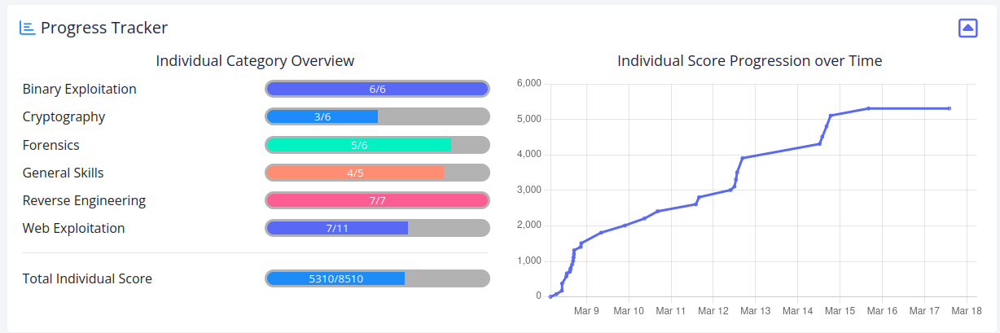

# picoCTF 2025 #

## Overview ##

I participated in the [picoCTF 2025](www.picoctf.org) competition as an individual competing in the Global category, organised by [Carnegie Mellon University](https://cmu.edu/), which ran from the 8'th to 17'th of March 2025 (local time). 

This is a write up of my progress and the challenges solved during the event.

## Pull Requests ##

As the purpose of this repository is to document my personal progress, capturing my approach and solutions identified, which may be of use to others and of future reference to myself, it doesn't make a lot of sense to accept pull requests for solutions I hadn't solved, sorry. I welcome comments or possible improvements to solutions to those challenges documented, but otherwise I recommend creating a similar repository of your own, which I can link to from here if desired.

## Progress ##

## Challenges ##

**This event write up is a work in progress (new solutions added as the write-ups are completed).**
 
As time permits I'll be adding further individual challenge write ups for all those marked as `(Solved)`, based on my notes taken during the event. Additionally there may be the odd challenge that I failed to solve but may want to document my progress, marked `(Unsolved - Progress Writeup)`.

  
Binary Exploitation (6 solutions)

* **[PIE TIME](Binary%20Exploitation/PIE%20TIME/PIE%20TIME.md) (Solved)** - 75 points
* **[hash-only-1](Binary%20Exploitation/hash-only-1/hash-only-1.md) (Solved)** - 100 points
* **[hash-only-2](Binary%20Exploitation/hash-only-2/hash-only-2.md) (Solved)** - 200 points
* **[PIE TIME 2](Binary%20Exploitation/PIE%20TIME%202/PIE%20TIME%202.md) (Solved)** - 200 points 
* **[Echo Valley](Binary%20Exploitation/Echo%20Valley/Echo%20Valley.md) (Solved)** - 300 points 
* **[handoff](Binary%20Exploitation/handoff/handoff.md) (Solved)** - 400 points

  
Cryptography (0 solutions, 3 remaining to write up)

* hashcrack (Solved) - 100 points
* EVEN RSA CAN BE BROKEN??? (Solved) - 200 points
* Guess My Cheese (Part 1) (Solved) - 200 points
* Guess My Cheese (Part 2) (Unsolved) - 300 points
* ChaCha Slide (Unsolved) - 400 points
* Ricochet (Unsolved) - 500 points

  
Forensics (0 solutions, 4 remaining to write up)

* Ph4nt0m 1ntrud3r (Solved) - 50 points
* RED (Solved) - 100 points
* flags are stepic (Solved) - 100 points
* Bitlocker-1 (Unsolved) - 200 points
* Event-Viewing (Solved) - 200 points
* Bitlocker-2 (Unsolved) - 300 points

  
General Skills (0 solutions, 5 remaining to write up)

* FANTASY CTF (Solved) - 10 points
* (Removed) Chalkboard (Solved) - 100 points
* Rust fixme 1 (Solved) - 100 points
* Rust fixme 2 (Solved) - 100 points
* Rust fixme 3 (Solved) - 100 points
* YaraRules0x100 (Unsolved) - 200 points

  
Reverse Engineering (5 solutions, 2 remaining to write up)

* Flag Hunters (Solved) - 75 points
* **[Binary Instrumentation 1](Reverse%20Engineering/Binary%20Instrumentation%201/Binary%20Instrumentation%201.md) (Solved)** - 200 points
* Tap into Hash (Solved) - 200 points
* **[Chronohack](Reverse%20Engineering/Chronohack/Chronohack.md) (Solved)** - 200 points
* **[Quantum Scrambler](Reverse%20Engineering/Quantum%20Scrambler/Quantum%20Scrambler.md) (Solved)** - 200 points
* **[Binary Instrumentation 2](Reverse%20Engineering/Binary%20Instrumentation%202/Binary%20Instrumentation%202.md) (Solved)** - 300 points
* **[perplexed](Reverse%20Engineering/perplexed/perplexed.md) (Solved)** - 400 points

  
Web Exploitation (0 solutions, 7 remaining to write up)

* Cookie Monster Secret Recipe (Solved) - 50 points
* head-dump (Solved) - 50 points
* n0s4n1ty 1 (Solved) - 100 points
* SSTI1 (Solved) - 100 points
* WebSockFish (Unsolved) - 200 points
* 3v@l (Solved) - 200 points
* SSTI2 (Solved) - 200 points
* Apriti sesamo (Unsolved) - 300 points
* Pachinko (Solved) - 300 points
* Pachinko Revisited (Unsolved) - 500 points
* secure-email-service (Unsolved) - 500 points

Full solutions to the challenges are provided in the write ups, however the actual flag values are witheld.
